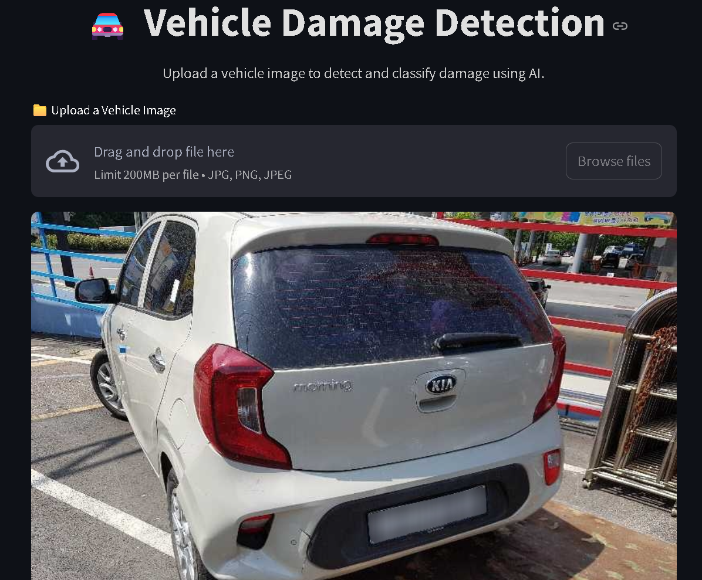
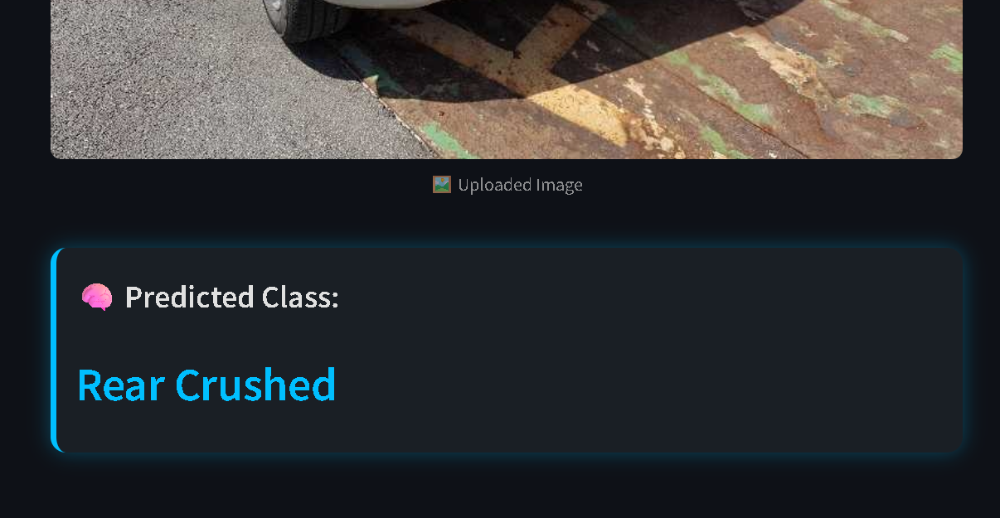

# 🚘 Vehicle Damage Detection App  

This Streamlit web app allows you to **upload or drag & drop** an image of a car and instantly get predictions about **the type of damage** it has.  

> ⚠️ **Note:** The model performs best when the uploaded image shows the **third-quarter front or rear view** of a vehicle, as that’s what it was trained on.

---

## 🧠 Model Overview  

This project uses **transfer learning with ResNet50** to classify vehicle damage from images.  

**Model Specifications:**
1. **Architecture:** ResNet50 (pretrained on ImageNet)
2. **Training Data:** ~1,700 labeled car images  
3. **Target Classes (6 total):**
   - Front Normal  
   - Front Crushed  
   - Front Breakage  
   - Rear Normal  
   - Rear Crushed  
   - Rear Breakage  
4. **Validation Accuracy:** ~80%  

---

## 🖥️ App Preview  

Below is a preview of the Streamlit interface:  


  

---

## ⚙️ Installation & Setup  

Follow these steps to run the app locally:

### 1. Clone the Repository  
```bash
git clone https://github.com/yourusername/vehicle-damage-detection.git
cd vehicle-damage-detection
```
### 2. Install Dependencies
```bash
pip install -r requirements.txt
```
### 3. Run the Streamlit App
```bash 
streamlit run .\app.py
```

## 📦 Project Structure
```bash 
Project-Car-Damage-Detection/
│
├── Streamlit-app/
│   ├── app.py                     # Streamlit frontend
│   ├── model_helper.py            # Model loading & prediction logic
│   ├── saved_model.pth            # Trained ResNet50 model weights
│
├── training/
│   ├── dataset/                   # Training dataset (images)
│   ├── damage_Prediction.ipynb    # Model training notebook
│   ├── hyper_Parameter_tuning.ipynb # Hyperparameter tuning notebook
│
├── app_screenshot.jpg             # App UI preview
├── app_screenshot_1.jpg           # App UI preview
├── requirements.txt               # Dependencies
└── README.md                      # Documentation
```
## 🚀 Features
✅ Drag-and-drop image upload.

✅ Real-time prediction using trained CNN model.

✅ Modern dark-themed Streamlit UI.

✅ Supports JPG, PNG, and JPEG formats.